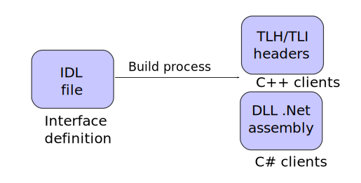

Examples of language-neutral [Component Object Model (COM)](https://learn.microsoft.com/en-us/windows/win32/com/the-component-object-model) interfaces for [IPC](https://en.wikipedia.org/wiki/Inter-process_communication) and interoperability between programming languages.

Project listing:

| Module       | Description                                 |
|--------------|---------------------------------------------|
| ComSupport   | .Net support functions for COM registration |
| MyInterfaces | COM interface definitions ([MyInterfaces.idl](MyInterfaces/MyInterfaces.idl)) |
| MyClientCpp  | Sample C++ _client_ |
| MyClientCs   | Sample C# _client_ |
| MyClientPy   | Sample Python _client_ |
| MyServerCpp  | C++ _server_ implementation |
| MyServerCs   | C# _server_ implementation |

Both servers are implemented as on-demand loaded COM EXE servers. The processes can also be started manually to facilitate background service deployment. The .Net samples are based on [OutOfProcCOM](https://github.com/dotnet/samples/tree/main/core/extensions/OutOfProcCOM).

The server projects implement the `IMyServer` interface whereas the client projects implement the `IMyClient` callback interface:  


## COM description
COM interfaces are first defined in IDL files. The IDL files are afterwards compiled into TLB type libraries, TLH/TLI headers and/or .Net DLL assemblies, depending on the target language(s):  


#### COM strengths:
* **Language neutral** interface definitions in IDL files.
* COM is **in-built in Windows**. There's no need to install any additional "runtime" or "brokers". COM is used for GPU programming with Direct3D, HW diagnostics with WMI and most new Windows features are exposed through COM-based [WinRT](https://github.com/microsoft/xlang) interfaces.
* Support for **type-safe** interfaces where type mismatches are detected at compile-time instead of run-time.
* Support for bidirectional **object-oriented** communication.
* Support for **interface versioning** for controlled API evolution.
* **Transparent IPC marshaling** of method calls. The client doesn't need to know that an object resides in a different process.
* Languages like C++ and C# natively support COM, whereas Python support is achieved through the [comtypes](https://github.com/enthought/comtypes) package. This **avoids** the need for manually maintained **language bindings**.
* **Rock solid** technology that has been available since 1993.
* Inherently **secure** with design protection against remote attacks. Does unlike sockets _not_ depend on opening any ports that need to be secured through authentication and firewall lockdown. Security settings are furthermore highly configurable.

#### COM limitations:
* Best practice is poorly documented.
* Some boilerplate code needed with C++.
* Not suited for network-based distributed communication APIs.
* Not as easily available on non-Windows platforms. The [MiniCOM](https://github.com/forderud/MiniCOM) project can partly mitigate this for in-process needs.

### COM concepts
Some common concepts:
* **IDL**: Interface Definition Language source file. Used for defining COM interfaces, classes and type libraries.
* **Interface**: Collection of callable functions that a class can implement. Expressed in a language-neutral way. Identified by a GUID<sup>[1]</sup>. **Cannot be changed** after an external release<sup>[2]</sup>.
* **Class**: Concrete implementation of one or more COM interfaces. Can _optionally_ be identified by a ClassID (CLSID) GUID<sup>[1]</sup> to  make class instances directly [creatable](https://learn.microsoft.com/en-us/windows/win32/learnwin32/creating-an-object-in-com).
* **Type library** (TLB): Binary file format used by the COM runtime to marshal calls between languages and processes. Identified by a GUID<sup>[1]</sup>. Can either be stored in a separate TLB file or embedded into the COM server EXE or DLL.
* **ProgID**: Optional string-based programmatic identifier for a COM class. Used to map a human-readable string to a ClassID, so that developers don't need to work directly with the underlying GUID.

<sup>[1]</sup> Globally Unique Identifier (GUID) are 128bit values typically expressed as a `{xxxxxxxx-xxxx-xxxx-xxxx-xxxxxxxxxxxx}` hexadecimal string. Must be globally unique, so they **cannot be copied between projects**. Typically generated with the `uuidgen.exe` tool from a Developer Command Prompt.

<sup>[2]</sup> Neither COM interfaces nor their associated data structures or enumerations can be changed after an external release, since that would break compatibility with existing code. Developers instead need to create a new interface with a new GUID when changes are required. It's then common to add a version number suffix to the interface name as versioning scheme.

### COM server types
COM servers can be compiled as either:
* **DLL**: Server that runs in the _same process_ as the client (in-process)<sup>[1]</sup>. This allows for more efficient direct communication without IPC. However, it does not allow for failure isolation or security sandboxing.
* **EXE**: Server that runs in a _separate process_ (out-of-process). This leads to some per-call marshalling overhead due to IPC. However, you get failure isolation so that a crashing server doesn't bring the client process down. The server can also run with more or fewer security privileges compared to the client.

COM provides transparent marshalling. This means that the client code doesn't need to know if the COM server runs in the same or a different process. The object that exposes a COM interface looks the same, regardless of if it's running in the same or a separate process or is implemented in a different programming language.

This repo focuses on IPC and does therefore only contain EXE-based servers, since there are fewer online resources on that. Microsoft provides [COMServerDemo](https://github.com/dotnet/samples/tree/main/core/extensions/COMServerDemo) sample code for DLL-based servers implemented in C#/.Net and [Create a Classic COM Component Using WRL](https://learn.microsoft.com/en-us/cpp/cppcx/wrl/how-to-create-a-classic-com-component-using-wrl) and [Component Object Model (COM) Sample](https://github.com/microsoft/component-object-model-sample) for servers implemented in C++.

<sup>[1]</sup> DLL-based COM servers can also be started in a separate process if configuring a [DllSurrogate](https://learn.microsoft.com/en-us/windows/win32/com/dllsurrogate). This can sometimes be useful for testing, since it allows the same COM server to either be loaded in-proc or out-of-proc without having to rebuild it.

### Exception mapping
Both C++, .Net and Python can automatically map COM `HRESULT` error codes to exceptions, so that developers doesn't need to explicitly check each call for failure.

#### Details:
* **C++** with generated TLH-wrappers: `HRESULT` error codes are automatically mapped to [`_com_error`](https://learn.microsoft.com/en-us/cpp/cpp/com-error-class) exceptions. It's still possible to call the "old" HRESULT versions by adding a `raw_` prefix to the method names.
* **.Net**: `HRESULT` error codes are automatically [mapped to comparable .Net exceptions](https://learn.microsoft.com/en-us/dotnet/framework/interop/how-to-map-hresults-and-exceptions).
* **Python**: `HRESULT` error codes are automatically mapped to `COMError` exceptions.

### Threading
COM clients and servers can decide their [threading model](https://learn.microsoft.com/en-us/troubleshoot/windows/win32/descriptions-workings-ole-threading-models) for _incoming_ calls<sup>[1]</sup> by configuring the thread associated with the class(es) receiving callbacks to run in either:
* **Single-threaded apartment (STA)**<sup>[2]</sup>: Incoming calls are automatically serialized. This means that the client doesn't need to worry about thread safety, since the COM runtime ensures that only one incoming call is received at a time.
* **Multi-threaded apartment (MTA)**: Incoming calls are _not_ serialized and might arrive concurrently. This means that the client needs to use mutexes or similar to protect against race conditions.

<sup>[1]</sup> The threading model only affects _incoming_ calls marshalled by the COM runtime. This typically means COM servers implemented in a different programming language or running in a different process. Direct C++ communication between COM objects in the same process are not affected by the threading model.

<sup>[2]</sup> STA threads need to [pump messages](https://learn.microsoft.com/en-us/windows/win32/winmsg/using-messages-and-message-queues) to process incoming calls - just like all GUI applications does to process mouse & keyboard events. The implementation then needs to consider that _reentrancy can occur_ as part of the message pumping _if_ pumping messages while processing an incoming call.

## Advanced topics

### Security
Most security settings for a COM server can be configured through [AppID](https://learn.microsoft.com/en-us/windows/win32/com/appid-key) registry entries. The [COM Elevation Moniker](https://learn.microsoft.com/en-us/windows/win32/com/the-com-elevation-moniker) can furthermore be used to request startup of a COM server in an elevated process. See the [RunInSandbox](https://github.com/forderud/RunInSandbox) project for how to configure security sandboxing and elevation with COM.

### Memory management rules (for C++)
Rules:
* [Rules for Managing Reference Counts](https://learn.microsoft.com/en-us/windows/win32/com/rules-for-managing-reference-counts).
* Strings (BSTR): Allocated with [`SysAllocString`/`SysFreeString`](http://msdn.microsoft.com/en-us/library/windows/desktop/ms221105.aspx). Can use [`CComBSTR`](https://learn.microsoft.com/en-us/cpp/atl/reference/ccombstr-class) wrapper to ease access.
* Dynamic arrays (SAFEARRAY): Allocated with [`CoTaskMemAlloc`/`CoTaskMemFree`](http://msdn.microsoft.com/en-us/library/windows/desktop/ms678418.aspx). Can use [`CComSafeArray<T>`](https://learn.microsoft.com/en-us/cpp/atl/reference/ccomsafearray-class) to ease access.
* [Memory Management Rules](https://learn.microsoft.com/nb-no/windows/win32/com/memory-management-rules) for argument passing:
  - `[in]` arguments are allocated and freed by the caller (automatic for function beeing called).
  - `[out]` arguments are allocated by the function called and later freed by the caller.
  - `[in,out]` identical to `[in]`, but the function beeing called might also free & reallocate.
* Pointer semantics:
  - Method arguments are [`ref` by default](https://learn.microsoft.com/nb-no/windows/win32/rpc/default-pointer-types)
  - `[pointer_default()]`]: Set semantics for nested pointers. [Defaults to `unique`](https://learn.microsoft.com/nb-no/windows/win32/com/anatomy-of-an-idl-file) unless specified.
  - [`[ref]`](https://learn.microsoft.com/nb-no/windows/win32/midl/ref): Never NULL or aliased.
  - [`[unique]`](https://learn.microsoft.com/nb-no/windows/win32/midl/unique): Can be NULL, change to/from NULL but not aliased.
  - [`[ptr]`](https://learn.microsoft.com/nb-no/windows/win32/midl/ptr): Can be NULL, change to/from NULL and be aliased.

### Custom marshaling
Windows includes an in-built "automation" marshaler (oleaut32.dll) for propagating IPC calls between processes. This is sufficient for most projects, but it's also possible to customize IPC marshaling by implementing the [`IMarshal`](https://learn.microsoft.com/nb-no/windows/win32/api/objidl/nn-objidl-imarshal) interface. The [SharedMemMarshal](https://github.com/forderud/SharedMemMarshal) project demonstrates how a custom marshaler can utilize shared memory to avoid copying overhead when passing large amounts of data between processes.

## How to test
1. Ensure that you have a [Python](https://www.python.org/) interpreter associated with `.py` files.
1. Open the solution in [Visual Studio](https://visualstudio.microsoft.com/).
1. Build all projects.
1. Register the server:
    * Either run `MyServerCs.exe" /regserver`  with admin privileges,
    * Or run `MyServerCpp.exe" /regserver`  with admin privileges.
1. Run the test clients:
    * C++: run `MyClientCpp.exe`
    * C#: run `MyClientCs.exe`
    * Python: run `MyClientPy.py`
1. **Un**register the server to clean up:
    * Either run `MyServerCs.exe" /unregserver` with admin privileges,
    * Or run `MyServerCpp.exe" /unregserver`  with admin privileges,
    * Or run `UNREGISTER.bat` with admin privileges.

Server registration is only needed for on-demand loaded COM EXE servers and can be skipped if instead running the server in a background service that is auto-started. In that case, the TypeLib will still need to be registered at server startup.

The client programs should output something resembling this:
```
pi = 3.141592653589793
Received message:
  sev=Info
  time=7/4/2023 10:27:57 AM
  value=1.23
  desc=Hello there!
  color=(255, 0, 0)
  data=[0,1,2,3]
...
```
